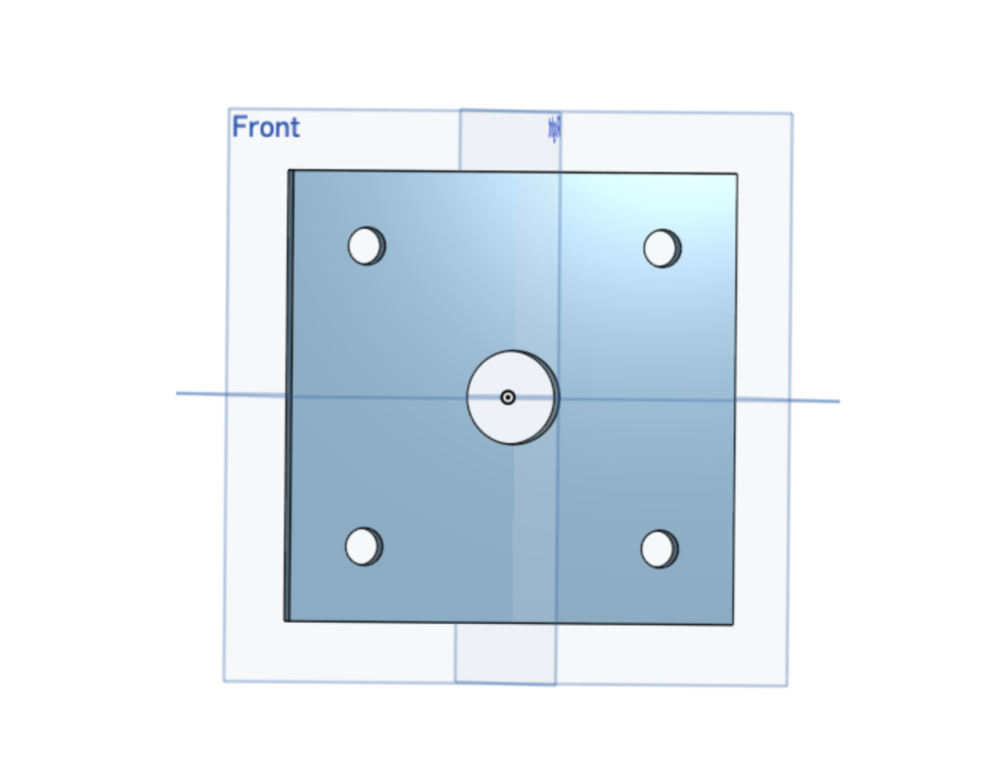
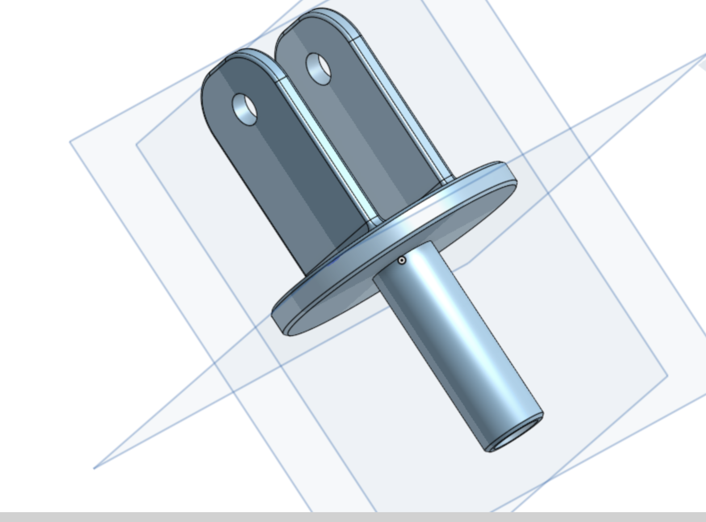
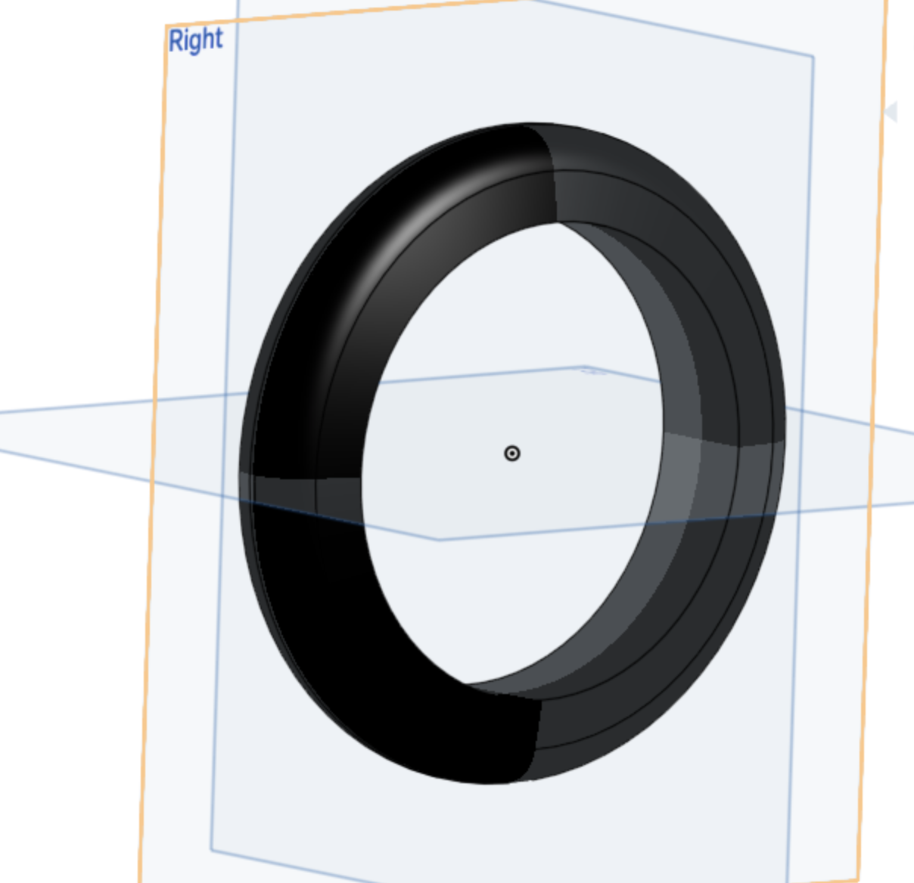
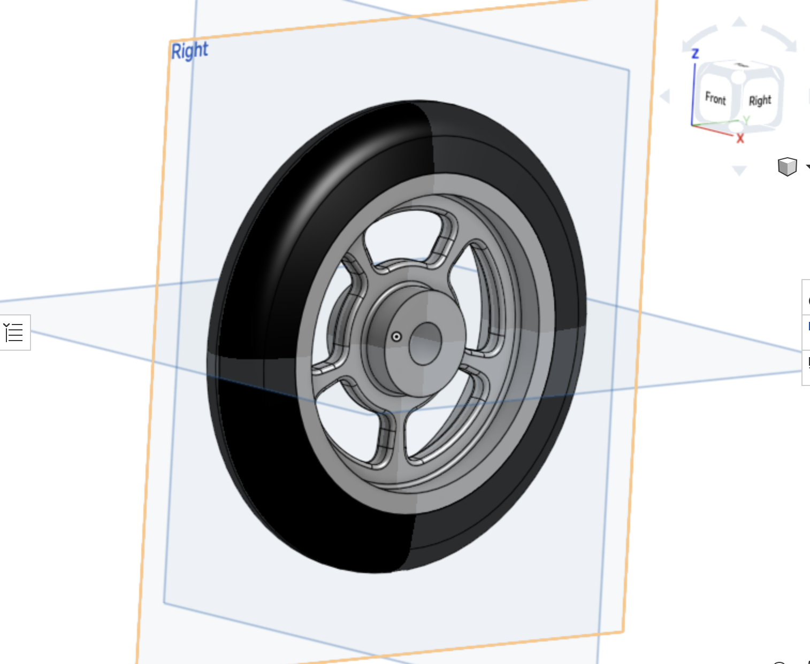
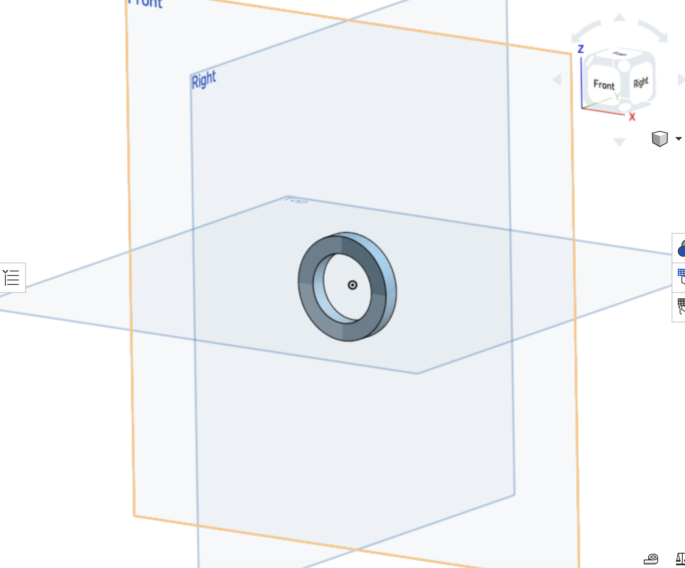
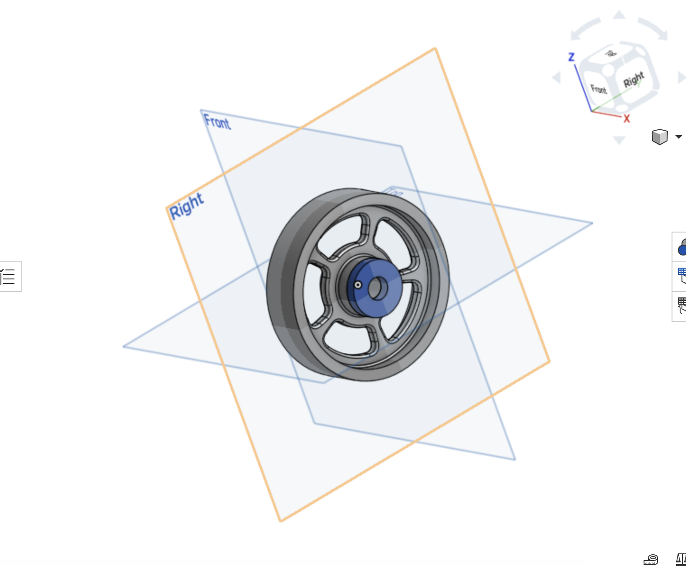

# BasicCAD

We are creating a caster.

---
## Table of Contents
* [Table of Contents](#Table-of-Contents)
* [Base](#Base)
* [Mount](#Mount)
* [Fork](#Fork)
* [Tire](#Tire)
* [Wheel](#Wheel)
* [AxleCollarBearings](#AxleCollarBearings)

## Base

### Description

The first assignment is to create the caster base.  The base's dimensions are 200 mm x 120 mm and 8 mm thick.  It has 6 holes 10 mm wide and 20 mm from the edge equally spaced along the edges.

### Evidence
[The Base in Onshape](https://cvilleschools.onshape.com/documents/0d70f655203ca304cb3c5b7d/w/f55603f962f6fc74f5548a68/e/41d730c570a8d75fce9f51b6)

### Image

### Reflection

This was my first Onshape part and [following along with Dr. Shields made it super easy.](https://www.youtube.com/watch?v=93BFUD-HAG8&feature=emb_title&scrlybrkr=5670f0b4)  I learned about 
* sketching (shortcut **shift-s**)
* constructions lines (shortcut **Q**)
* dimensions (shortcut **D**)
* extruding both add and remove (shortcut key **E**)
* linear patterns (no shortcut)

Onshape is awesome.  I found it really helpful to rename all my sketches.  It is going to be a GREAT year in engineering.

---

## Mount

### Image

### Description

The second assignment is to create a caster mount the dimensions are 120 mm by 120 mm and 8 mm thick with 5 holes 4 patterned to the corners 10 mm holes and 1 center 25 mm hole

### Evidence

https://cad.onshape.com/documents/61cc1b58f992282db309c2aa/w/f003c0469504d59500114640/e/bd8f94d24f3d1c4f69c3c72f

### Reflection

This was my second time in Onshape I felt very well prepared and this part was very easy but today adding the image of it in Github was so frustrating after an hour of trying and watching the video that I eventually gave up but I will try again tommorrow. I figured out this images and now it is easy.

---

## Fork

### Description

The fork is two tombstone shaped extrusions facing towards eachother with a hole going through both at the top ceter the tomstone are placed on a 8 mm thick circular base with a 75 mm tube extruding from the other side of the base.

### Evidence

https://cad.onshape.com/documents/41a1291870b7e6e8cbd519a6/w/0c42d09d9722f65b79aff8a6/e/ebfd2a44fa0546c8a2d749a6

### Image

### Reflection

Overall this was really fun I had a great time making it the mirror of the tombstone was confusing to me at first because it was so easy to do that I thought I was doing it wrong but Overall it was not too much of a challenge and was very fun.

---

## Tire

### Description

The sketch was a small trapezoid defined by a vertical and horizontal construction line coming from the origin. after the sketch was fully defined it was a simple revolve around the horizontal construction line and a fillet on the outside edge of the wheel and a color change to black. 

### Evidence

https://cad.onshape.com/documents/e5b327b9db1507838b2d3591/w/1d380116e1e034fa48077fba/e/aff5d5f30e74011b42f19392

### Image

### Reflection

The tire was really easy all it was was a simple trapezoid sketch, a revolve, and a fillet on an edge it took me about three minutes.

---

## Wheel

### Description

The wheel was very similar to the tire because it was a single I shaped sketch with a revolve but unlike the tire the revolve was larger and after it was finished I had to create 5 different spokes it a pattern along the face of the wheel.

### Evidence

https://cad.onshape.com/documents/e5b327b9db1507838b2d3591/w/1d380116e1e034fa48077fba/e/aff5d5f30e74011b42f19392

### Image

### Reflection

Overall I thought this was a pretty easy thing to build the video on how to make the spokes was very helpful though to make it.

---

## AxleCollarBearings

### Description

### Evidence

https://cad.onshape.com/documents/147e945bbf8694e44dccbcc0/w/6ea985a45e8946ffe4b2df01/e/899d417d45405b9fb8a6af90

https://cad.onshape.com/documents/24b365e6e903e87fff7015fd/w/0a55cfa66fecc8941f26a2ed/e/284a5fd4efe0a829094e46fb

https://cad.onshape.com/documents/e5b327b9db1507838b2d3591/w/1d380116e1e034fa48077fba/e/aff5d5f30e74011b42f19392

### Image

### Reflection

---
